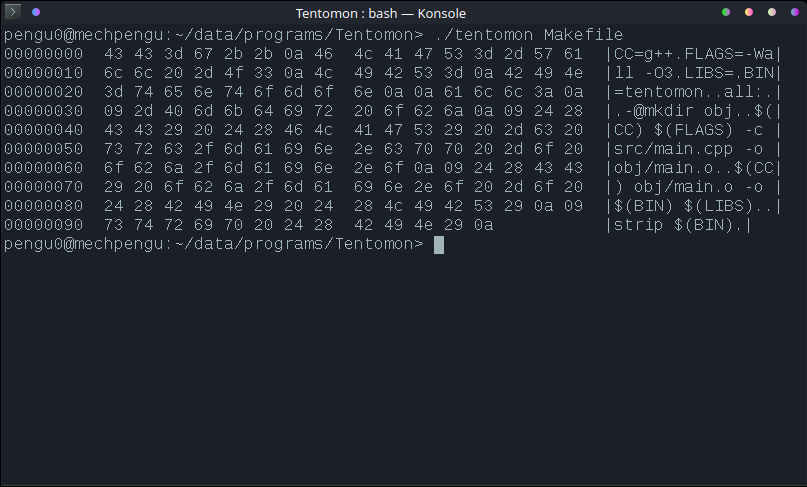

# Tentomon - hexadecimal viewer

A simple software for printing hexadecimal values of the given file.
The switches can help separate useful data.



## Example usage

Usage help message:

```
$ ./tentomon -h
Usage: ./tentomon [OPTIONS] FILE
Options:
-A       Don't show address offsets.
-a       Show address offsets.
-P       Don't print readable ASCII characters.
-H       Only print hexadecimal values.
         This is a combination of -A and -P switches.
-h       Help messages.
```

Print hexadecimal values of a file with their ASCII counterpart, ignoring address offsets:

```
$ ./tentomon -A ./src/main.cpp
…
69 6e 74 20 69 20 3d 20  30 3b 20 69 20 3c 20 31  |int i = 0; i < 1|
36 3b 20 69 2b 2b 29 0a  09 09 09 7b 0a 09 09 09  |6; i++)....{....|
09 63 68 61 72 20 63 3b  0a 09 09 09 09 69 66 20  |.char c;.....if |
28 69 20 3c 20 72 65 61  64 63 6f 75 6e 74 29 0a  |(i < readcount).|
09 09 09 09 7b 0a 09 09  09 09 09 09 69 66 20 28  |....{.......if (|
62 75 66 66 65 72 5b 69  5d 20 3c 20 33 32 20 7c  |buffer[i] < 32 ||
7c 20 31 32 36 20 3c 20  62 75 66 66 65 72 5b 69  || 126 < buffer[i|
5d 29 0a 09 09 09 09 09  09 7b 0a 09 09 09 09 09  |]).......{......|
09 09 63 20 3d 20 27 2e  27 3b 0a 09 09 09 09 09  |..c = '.';......|
09 7d 0a 09 09 09 09 09  09 65 6c 73 65 0a 09 09  |.}.......else...|
09 09 09 09 7b 0a 09 09  09 09 09 09 09 63 20 3d  |....{........c =|
20 62 75 66 66 65 72 5b  69 5d 3b 0a 09 09 09 09  | buffer[i];.....|
09 09 7d 0a 09 09 09 09  09 09 73 74 64 3a 3a 63  |..}.......std::c|
6f 75 74 20 3c 3c 20 63  3b 0a 09 09 09 09 7d 0a  |out << c;.....}.|
09 09 09 09 65 6c 73 65  0a 09 09 09 09 7b 0a 09  |....else.....{..|
09 09 09 09 62 72 65 61  6b 3b 0a 09 09 09 09 7d  |....break;.....}|
0a 09 09 09 7d 0a 09 09  09 73 74 64 3a 3a 63 6f  |....}....std::co|
75 74 20 3c 3c 20 22 7c  22 3b 0a 09 09 7d 0a 09  |ut << "|";...}..|
09 73 74 64 3a 3a 63 6f  75 74 20 3c 3c 20 73 74  |.std::cout << st|
64 3a 3a 65 6e 64 6c 3b  0a 09 09 69 66 20 28 66  |d::endl;...if (f|
69 6c 65 2e 65 6f 66 28  29 29 0a 09 09 7b 0a 09  |ile.eof())...{..|
09 09 62 72 65 61 6b 3b  0a 09 09 7d 0a 09 7d 0a  |..break;...}..}.|
09 72 65 74 75 72 6e 20  30 3b 0a 7d 0a           |.return 0;.}.|
```
